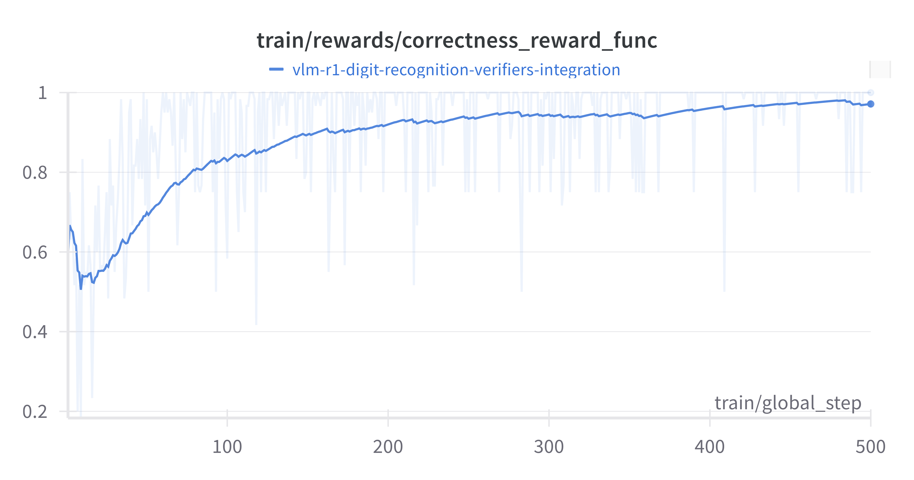
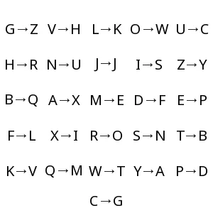
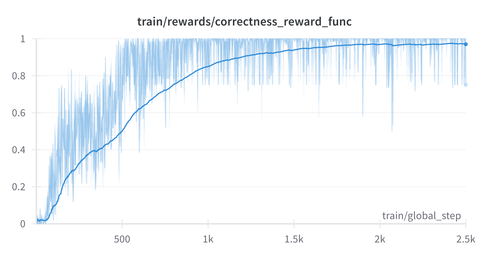

# r1_vlm
Making it easy to train a VLM with GRPO. 

Here's a demo of a model we trained to solve cryptograms. Try the model for yourself using our demo on HuggingFace: [TODO ADD LINK/BUTTON HERE]. Read more about this project here: [TODO ADD LINK TO BLOG POST HERE].

https://github.com/user-attachments/assets/8ca0d408-452a-4c24-ba54-7421cfed8b29
In this demo, you can see our model solve the cryptogram: `groundlight loves ml`. We visualize the model's attention weights from an intermediate layer of the model.  You can see its attention to the image is relatively diffuse initially, and then becomes hyper focused on the relevant region of the decoder as it decodes each letter in sequence. In effect, the model has learned to “read” the relevant regions of the decoder as it needs them.


# Installation
TODO: update this section once I port over the code to gl org.
This project relies on forks of some dependencies. First clone this repo. Then clone the following repos adjaces to this one. The two forks are installed as editable dependencies into `r1_vlm`. I don't have a stable branch for which branch on these forks to use, as I'm actively changing them. You can see the latest PRs in the relevant repos or leave an issue on this repo and I'll help you out. 
```
1. git clone git@github.com:sunildkumar/r1_vlm.git
2. git clone git@github.com:sunildkumar/trl.git # this is my fork of TRL with added support for VLMs, verifiers, and vllm.
3. git clone git@github.com:sunildkumar/verifiers.git # this is my fork of the verifiers library, which updates the TRL dependency from HuggingFace's to my fork (above).
```

Afterwards, your directory structure should look like this:
```
r1_vlm/
trl/
verifiers/
```

Then install with `uv`:
```
cd r1_vlm
uv sync
```

# Task 1: Message Decoding
We trained a VLM to solve cryptograms. A cryptogram is a message that has been encoded using a substitution cipher. The model is given a coded message and a decoder image, and it must decode the message back to the original word. We put a reasonable amount of effort into the reward function design here, so it is worth checking that out if you're interested in our approach. Our model achieves 96% on our held out evaluation set. Try the demo on HuggingFace here: [TODO ADD LINK HERE]. See our blog post discussing technical details here: [TODO ADD LINK HERE].

You can see the "raw" dataset [here](https://huggingface.co/datasets/sunildkumar/message-decoding-words-and-sequences) and then the R1 setup on top [here](https://huggingface.co/datasets/sunildkumar/message-decoding-words-and-sequences-r1).

You can run training on 4 GPUs, 3 for training, one for completion generation with `vllm` using the following command. We've tested it on 4x A100 80GB GPUs. You can also get it running on two GPUs as well by tuning down the number of generations and running without `deepspeed`.

```bash
# 4 GPU training with deepspeed
CUDA_VISIBLE_DEVICES=0,1,2,3 uv run accelerate launch --config_file src/r1_vlm/deepspeed_configs/multi_gpu_3only.yaml src/r1_vlm/environments/message_decoding_words_and_sequences_env/train.py

# 2 GPU training without deepspeed, you'll need to adjust the number of generations in the train.py file.
CUDA_VISIBLE_DEVICES=0,1 uv run src/r1_vlm/environments/message_decoding_words_and_sequences_env/train.py
```

Training results:


# Task 1: Digit Recognition
As proof that the code works, I trained `Qwen2.5VL-3B-Instruct` on a digit recognition task derived from MNIST. In each image, there are one, two or three digits. For each image, the model is either asked to return the list of digits in ascending order, or the sum of the digits.

You can see the "raw" dataset [here](https://huggingface.co/datasets/sunildkumar/digit-recognition) and then the R1 setup on top [here](https://huggingface.co/datasets/sunildkumar/digit-recognition-r1).

Example image from the dataset:


You can run training on 4 GPUs, 3 for training, one for completion generation with `vllm` using the following command. We've tested it on 4x A100 80GB GPUs. You can also get it running on two GPUs as well by tuning down the number of generations and running without `deepspeed`.
```bash

# 4 GPU training with deepspeed
CUDA_VISIBLE_DEVICES=0,1,2,3 uv run accelerate launch --config_file src/r1_vlm/deepspeed_configs/multi_gpu_3only.yaml src/r1_vlm/environments/digit_recognition_env/train.py

# 2 GPU training without deepspeed, you'll need to adjust the number of generations in the train.py file.
CUDA_VISIBLE_DEVICES=0,1 uv run src/r1_vlm/environments/digit_recognition_env/train.py
```

Results:


# Task 2: Message Decoding
This task is more complex. We've created a dataset of "coded messages". Each message is a common english word. We define a coding/decoding mapping that we use to scramble the word, creating a coded message. We then provide the model with the coded message and the decoder image, and ask the model to decode the message back to the original word. This task has the nice property that it is very difficult to solve without engaging with both text and image modalities (technically, for some words, there is a unique solution but it is unlikely that the model knows this). You can see the full dataset
[here](https://huggingface.co/datasets/sunildkumar/message-decoding-words).


## Example Reasoning Trace:
Here's an example where the message is "VISION". 



```
system
You are a helpful assistant. You first think about the reasoning process in the mind and then provide the user with the answer.

user
Use the decoder in the image to decode this coded message: "K X I X R S". The decoded message should be an english word. Show your work in <think> </think> tags and return the answer in <answer> </answer> tags, for example <answer> "CAT" </answer>.

assistant
Let me solve this step by step.
<think> 
1. First, I'll decode each character in the message "K X I X R S" using the provided decoder:

   K → V
   X → I
   I → S
   X → I
   R → O
   S → N

2. Now, I'll Combine the results: "V I S I O N".

Answer: VISION

Answer: VISION

</think>
<answer>VISION</answer>
```

You can train with:
```bash 
# 4 GPU training with deepspeed
CUDA_VISIBLE_DEVICES=0,1,2,3 uv run accelerate launch --config_file src/r1_vlm/deepspeed_configs/multi_gpu_3only.yaml src/r1_vlm/environments/message_decoding_env/train.py

# 2 GPU training, you'll need to adjust the number of generations in the train.py file.
CUDA_VISIBLE_DEVICES=0,1 uv run src/r1_vlm/environments/message_decoding_env/train.py
```

Training results:



## Training:
```
# run from root of repo
uv run accelerate launch --config_file train/multi_gpu.yaml  train/train.py

uv run accelerate launch --config_file train/multi_gpu.yaml  train/train_counting.py

CUDA_VISIBLE_DEVICES=1,2,3 uv run accelerate launch --config_file train/multi_gpu_3only.yaml  train/train_counting.py

CUDA_VISIBLE_DEVICES=1 uv run train/train_counting.py


```